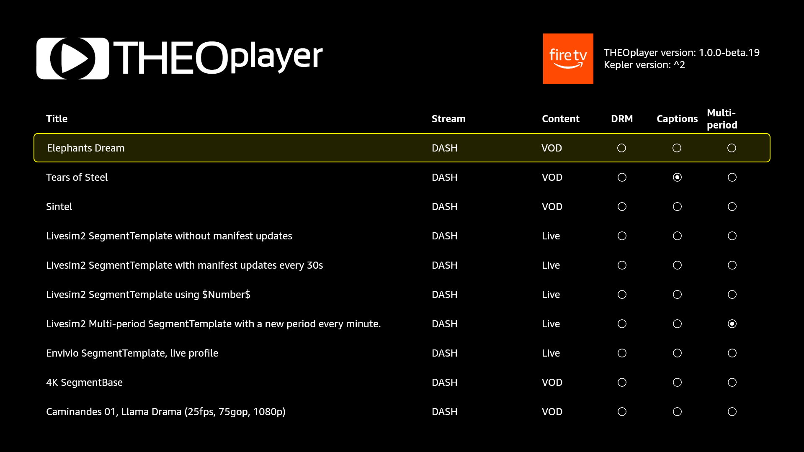
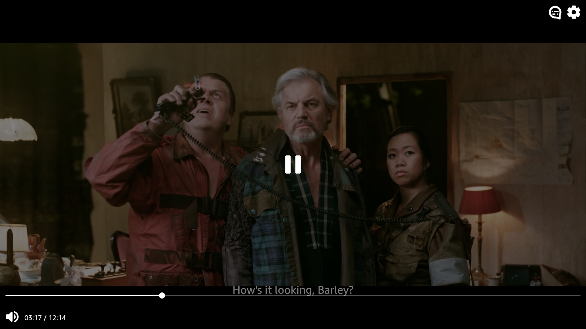

## Example Application

The example application builds upon the `@theoplayer/react-native-vega` package to create a functional
Vega app.

The `@theoplayer/react-native-vega` package is a private npm package, located in the `/.lib` folder,
which provides a `THEOplayerView` component that aligns with our `react-native-theoplayer` SDK.



### Prerequisites

- Vega **v0.21** (25-10-01)
- In order to use one of these THEOplayer SDKs, it is necessary to obtain a **valid React Native THEOplayer license**. You can sign up for a THEOplayer SDK license through [our portal](https://portal.theoplayer.com/).
- The local npm THEOplayer packages, which are not publicly available yet but provided in the `lib` folder:
    - `@theoplayer/vega`: THEOplayer native SDK for Vega.
    - `@theoplayer/react-native-vega`: React Native API for Vega.
    - `@theoplayer/theomux-vega`: Turbo module hosting THEO's own transmuxing functionality for TS-based HLS streams.
- Optionally, Visual Studio Code with Vega plugins is installed.

### Build

Install dependencies:

`npm install`

Then build & run preferable using Visual Studio Code's Vega extensions, or alternatively:

`npm run app:release`



### Player creation

The player is created using the `THEOplayerView` component. A basic example is shown below:

```tsx
import React, {useState} from 'react';
import {View} from 'react-native';
import {THEOplayer, PlayerConfiguration, THEOplayerView} from '@theoplayer/react-native-vega';

const playerConfig: PlayerConfiguration = {
  // insert THEOplayer React Native license here
  license: undefined,
};

export const App = () => {
  const [player, setPlayer] = useState<THEOplayer | undefined>(undefined);

  const onPlayerReady = (player: THEOplayer) => {
    setPlayer(player);
    player.autoplay = true;
    player.source = {
      "sources": [
        {
          "src": "https://cdn.theoplayer.com/video/sintel/nosubs.m3u8",
          "type": "application/x-mpegurl"
        }
      ]
    };
  };

  return (
    <View style={{flex: 1}}>
      <THEOplayerView config={playerConfig} onPlayerReady={onPlayerReady} />
    </View>
  );
}
```

### Headless player

Optionally, a player can be created in headless mode, already providing it with a source.

```tsx
const playerConfig: PlayerConfiguration = {
  // insert THEOplayer React Native license here  
  license: undefined,
};

const vegaPlayer = await THEOplayer.create(config);
vegaPlayer.source = { /*...*/};
```

The headless player can then be attached to a `THEOplayerView` component later on:

```tsx
<THEOplayerView player={vegaPlayer} />
```
